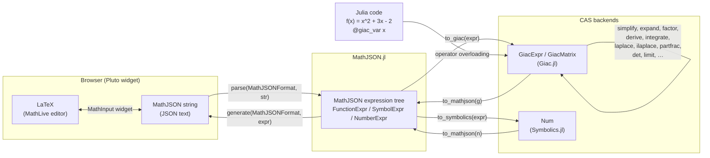
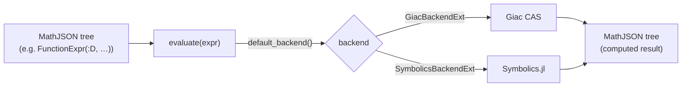
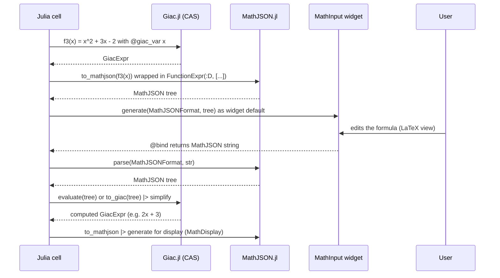

# Formula representation flows

Symbolic mathematical formulas live in several representations across the
MathJSONComputeEngineBridge.jl ecosystem. This page maps each representation
and the functions that convert between them.

## The representations

| Representation | Julia type | Package | Role |
|---|---|---|---|
| LaTeX | `String` | MathLive (browser) | Human-friendly input/display in the `MathInput` widget |
| MathJSON string | `String` | [MathJSON.jl](https://github.com/s-celles/MathJSON.jl) | Serialized JSON text, e.g. `["Add",["Power","x",2],1]` — the wire format returned by `@bind` |
| MathJSON expression tree | `FunctionExpr`, `SymbolExpr`, `NumberExpr`, `StringExpr` | MathJSON.jl | Structured Julia objects, the lingua franca of the bridge |
| Giac expression | `GiacExpr`, `GiacMatrix` | [Giac.jl](https://github.com/s-celles/Giac.jl) | Handle into the Giac/Xcas CAS where actual computation happens |
| Symbolics expression | `Num` | Symbolics.jl (optional) | Alternative CAS backend via a package extension |

## The big picture

Three ideas to keep in mind:

1. **The MathJSON expression tree is the hub.** Every other representation
   converts to or from it; no direct LaTeX ↔ Giac path exists.
2. **Strings are for transport, trees are for programs.** The `@bind` value of
   a `MathInput` is always a *string*; call `parse(MathJSONFormat, str)` before
   doing anything structural with it.
3. **Computation only happens in a CAS.** MathJSON.jl represents formulas but
   does not simplify or differentiate them — that is Giac's (or Symbolics')
   job, reached through `to_giac` / `evaluate`.

## `evaluate`: the bridge shortcut

`MathJSONComputeEngineBridge.evaluate` hides the round trip through the
backend: it takes a MathJSON tree, computes it in the configured backend, and
hands back a MathJSON tree.

The backends are wired in through package extensions: loading `Giac`
(respectively `Symbolics`) next to `MathJSONComputeEngineBridge` activates
`GiacBackendExt` (respectively `SymbolicsBackendExt`).

## A typical Pluto round trip

What happens when a notebook pre-fills a widget from a Julia formula, lets the
user edit it, and computes the result:

## Conversion cheat sheet

| From | To | Call |
|---|---|---|
| MathJSON string | MathJSON tree | `parse(MathJSONFormat, str)` |
| MathJSON tree | MathJSON string | `generate(MathJSONFormat, expr)` |
| MathJSON tree | `GiacExpr` | `to_giac(expr)` |
| `GiacExpr` / `GiacMatrix` | MathJSON tree | `to_mathjson(g)` |
| Julia function + `@giac_var` | `GiacExpr` | just call it: `f(x)` |
| MathJSON tree | MathJSON tree (computed) | `evaluate(expr)` |
| MathJSON string | widget default | `MathInput(default=str, format=:mathjson)` |

Unevaluated operators such as `["D", …]` or `["Integrate", …]` stay symbolic
in the tree until `evaluate` (or a CAS function like `derive`/`integrate` after
`to_giac`) is applied — building the tree does not compute anything.
